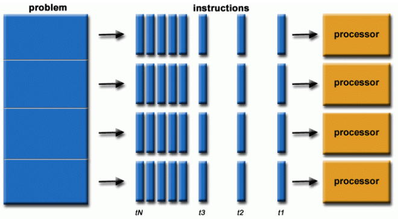

---
# You can also start simply with 'default'
theme: apple-basic
# random image from a curated Unsplash collection by Anthony
# like them? see https://unsplash.com/collections/94734566/slidev
background: https://cover.sli.dev
# some information about your slides (markdown enabled)
title: "Processamento paralelo: Go vs. Node.js"
# info: |
#   ## Slidev Starter Template
#   Presentation slides for developers.

#   Learn more at [Sli.dev](https://sli.dev)
# apply unocss classes to the current slide
class: text-center
# https://sli.dev/features/drawing
drawings:
  persist: false
# slide transition: https://sli.dev/guide/animations.html#slide-transitions
transition: slide-left
# enable MDC Syntax: https://sli.dev/features/mdc
mdc: true
hideInToc: true
layout: center
---

# Processamento paralelo: Go vs. Node.js


<div class="abs-br m-6 flex gap-2">
  <button @click="$slidev.nav.openInEditor()" title="Abrir no editor" class="text-xl slidev-icon-btn opacity-50 !border-none !hover:text-white">
    <carbon:edit />
  </button>
  <a href="https://github.com/douglasdemoura/processamento-paralelo-go-vs-nodejs" target="_blank" alt="GitHub" title="Abra no GitHub"
    class="text-xl slidev-icon-btn opacity-50 !border-none !hover:text-white">
    <carbon-logo-github />
  </a>
</div>

<!--
Esta apresentação explora as capacidades de processamento paralelo em Go e Node.js. Compararemos seus modelos de concorrência, examinaremos exemplos de código e discutiremos as implicações de desempenho. Através de demonstrações práticas, incluindo uma estimativa de Pi usando o método de Monte Carlo, destacaremos os pontos fortes e casos de uso de cada linguagem em cenários de computação paralela. Seja você um desenvolvedor escolhendo entre essas tecnologias ou um arquiteto projetando sistemas escaláveis, esta palestra fornecerá insights valiosos sobre como aproveitar o processamento multi-core em Go e Node.js.
-->

---
transition: slide-up
level: 2
---

# Introdução

- Processamento paralelo em aplicações modernas:
  - Uso de múltiplos núcleos de CPU;
  - Cálculo matriciais para aplicações de ML e AI.

<br>

$$
\mathbf{A}=\begin{pmatrix}
 a_{11} & a_{12} & \cdots & a_{1n} \\
 a_{21} & a_{22} & \cdots & a_{2n} \\
 \vdots & \vdots & \ddots & \vdots \\
 a_{m1} & a_{m2} & \cdots & a_{mn} \\
\end{pmatrix} \cdot \quad\mathbf{B}=\begin{pmatrix}
 b_{11} & b_{12} & \cdots & b_{1p} \\
 b_{21} & b_{22} & \cdots & b_{2p} \\
 \vdots & \vdots & \ddots & \vdots \\
 b_{n1} & b_{n2} & \cdots & b_{np} \\
\end{pmatrix}
$$

$$
\mathbf{C} = \begin{pmatrix}
 a_{11}b_{11} +\cdots + a_{1n}b_{n1} & a_{11}b_{12} +\cdots + a_{1n}b_{n2} & \cdots & a_{11}b_{1p} +\cdots + a_{1n}b_{np} \\
 a_{21}b_{11} +\cdots + a_{2n}b_{n1} & a_{21}b_{12} +\cdots + a_{2n}b_{n2} & \cdots & a_{21}b_{1p} +\cdots + a_{2n}b_{np} \\
\vdots & \vdots & \ddots & \vdots \\
 a_{m1}b_{11} +\cdots + a_{mn}b_{n1} & a_{m1}b_{12} +\cdots + a_{mn}b_{n2} & \cdots & a_{m1}b_{1p} +\cdots + a_{mn}b_{np} \\
\end{pmatrix} 
$$

<!--
Referências: https://www.ibm.com/think/topics/parallel-computing
-->

---
layoutClass: gap-16
---

# Paralelismo

Só é possível em sistemas multi-core ou com múltiplos processadores onde cada core ou processador executa instruções independentemente.

 

---
layout: image-right
image: /images/cassino.png
---

# Método de Monte Carlo

Imagine que você tem um problema complicado demais para resolver com matemática tradicional.

Uma maneira legal de lidar com isso é usando números aleatórios para encontrar uma solução. Você gera um monte de números aleatórios e vê quantos deles se encaixam nas regras que você está trabalhando.

Essa técnica é muito útil para obter respostas numéricas quando o problema é difícil demais para resolver analiticamente.


---
level: 2
---

# Calculando uma aproximação de Pi com Go

```go
package main

import (
	"math/rand/v2"
	"sync"
)

// Quanto maior o número de samples, mais preciso o resultado
func MonteCarloPi(numSamples int) float64 {
	countInside := 0

	for i := 0; i < numSamples; i++ {
		x := rand.Float64()
		y := rand.Float64()
		if x*x+y*y <= 1 {
			countInside++
		}
	}

	return (float64(countInside) / float64(numSamples)) * 4
}
```

---

# Paralelizando o cálculo de Pi com Go

````md magic-move
```go
package main

import (
	"math/rand/v2"
	"sync"
)
```
```go
func monteCarloPiWorker(numSamples int, results chan int, wg *sync.WaitGroup) {
	defer wg.Done()
	countInside := 0

	for i := 0; i < numSamples; i++ {
		x := rand.Float64()
		y := rand.Float64()
		if x*x+y*y <= 1 {
			countInside++
		}
	}

	results <- countInside
}
```
```go
func MonteCarloPiParallel(numSamples, numWorkers int) float64 {
	var wg sync.WaitGroup
	results := make(chan int, numWorkers)
	samplesPerWorker := numSamples / numWorkers

	for i := 0; i < numWorkers; i++ {
		wg.Add(1)
		go monteCarloPiWorker(samplesPerWorker, results, &wg)
	}

	wg.Wait()
	close(results)

	totalInside := 0
	for countInside := range results {
		totalInside += countInside
	}

	return (float64(totalInside) / float64(numSamples)) * 4
}
```
````

---

# Benchmarks

```go
package main

import (
	"runtime"
	"testing" 
)

var samples = 1000000

func BenchmarkMonteCarloPi(b *testing.B) {
	for i := 0; i < b.N; i++ {
		MonteCarloPi(samples)
	}
}

func BenchmarkMonteCarloPiParallel(b *testing.B) {
	for i := 0; i < b.N; i++ {
		MonteCarloPiParallel(samples, runtime.NumCPU())
	}
}

```

---

# Benchmarks

```bash
$ go test -benchmem -bench=.

goos: linux
goarch: amd64
pkg: example/sieve
cpu: Intel(R) Core(TM) i5-8300H CPU @ 2.30GHz
BenchmarkMonteCarloPi-8                   51        21019220 ns/op               0 B/op         0 allocs/op
BenchmarkMonteCarloPiParallel-8          199         9788952 ns/op             596 B/op        10 allocs/op
PASS
ok      example/montecarlo   3.689s
```

---

# Calculando uma aproximação de Pi com JavaScript

```javascript
function monteCarloPi(numSamples) {
  let countInside = 0

  for (let i = 0; i < numSamples; i++) {
    const x = Math.random()
    const y = Math.random()
    if (x * x + y * y <= 1) {
      countInside++
    }
  }

  return (countInside / numSamples) * 4
}
```

---

# Paralelizando o cálculo de Pi com Node.js

````md magic-move
```javascript
// monte-carlo-worker.js
import { parentPort } from 'node:worker_threads'

parentPort.on('message', (numSamples) => {
  let countInside = 0

  for (let i = 0; i < numSamples; i++) {
    const x = Math.random()
    const y = Math.random()

    if (x * x + y * y <= 1) {
      countInside++
    }
  }

  parentPort.postMessage(countInside);
})
```
```javascript {*}{maxHeight:'100px'}
// monte-carlo-parallel.js
import { Worker } from 'node:worker_threads'

export function monteCarloPiParallel(numSamples, numWorkers) {
  return new Promise((resolve, reject) => {
    const samplesPerWorker = Math.floor(numSamples / numWorkers)
    const workers = []
    let totalInside = 0
    let completedWorkers = 0

    for (let i = 0; i < numWorkers; i++) {
      const worker = new Worker('./monte-carlo-worker.js')
      workers.push(worker)

      worker.on('message', (countInside) => {
        totalInside += countInside
        completedWorkers++
        if (completedWorkers === numWorkers) resolve((totalInside / numSamples) * 4)
      })

      worker.on('error', (err) => { reject(err) })
      worker.postMessage(samplesPerWorker)
    }
  })
}
```
````

---

# Benchmarks

```javascript {*}{maxHeight:'400px'}
import Benchmark from 'benchmark'
import { monteCarloPi } from './monte-carlo.js'
import { monteCarloPiParallel } from './monte-carlo-parallel.js'

const numSamples = 1000000
const numWorkers = 8

const suite = new Benchmark.Suite

suite
  .add('MonteCarloPi (single-threaded)', (deferred) => {
    monteCarloPi(numSamples)
    deferred.resolve()
  }, { defer: true })
  .add('MonteCarloPiParallel (multi-threaded)', {
    defer: true,
    fn: async (deferred) => {
      await monteCarloPiParallel(numSamples, numWorkers)
      deferred.resolve()
    }
  })
  .on('cycle', (event) => {
    console.log(String(event.target))
  })
  .on('complete', function() {
    console.log(`Fastest is ${this.filter('fastest').map('name')}`)
  })
  .run({ 'async': true })
```

---

# Benchmarks

```bash
$ node benchmark.js
MonteCarloPi (single-threaded) x 40.00 ops/sec ±1.84% (65 runs sampled)
MonteCarloPiParallel (multi-threaded) x 6.43 ops/sec ±10.17% (34 runs sampled)
Fastest is MonteCarloPi (single-threaded)
```

---

# Análise

- Go é mais eficiente para processamento paralelo no exemplo citado;
- Node.js perde em desempenho no processamento paralelo no exemplo citado.


---

# Obrigado
- **Nome:** Douglas Moura
- **E-mail:** contato@douglasmoura.dev
- **LinkedIn:** [https://www.linkedin.com/in/dougmoura](https://www.linkedin.com/in/dougmoura)
- **GitHub:** [https://github.com/douglasdemoura](https://github.com/douglasdemoura)
- **Twitter:** [@douglasdemoura](https://twitter.com/douglasdemoura)


### Recursos adicionais:
- **Repositório do projeto:** [https://github.com/processamento-paralelo-go-vs-nodejs](https://github.com/processamento-paralelo-go-vs-nodejs)

